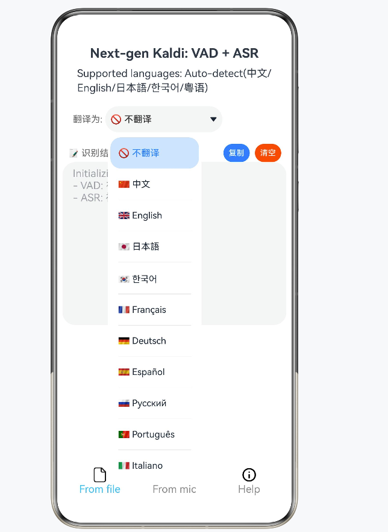
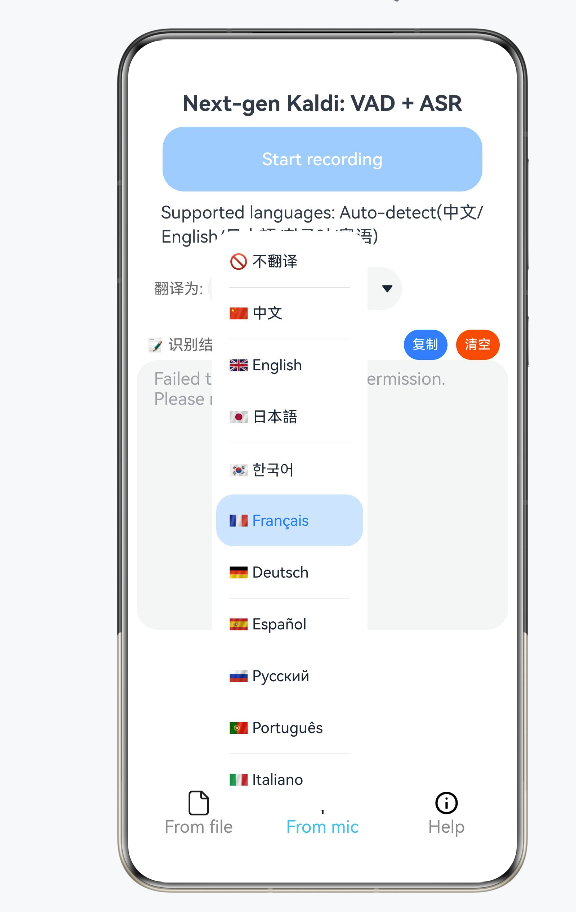

# HeardVoice - 鸿蒙本地语音识别助手

基于 [sherpa-onnx](https://github.com/k2-fsa/sherpa-onnx) 的 HarmonyOS 本地语音识别应用，支持全设备响应式适配。

## 功能特性

- 🎙️ 本地语音识别（VAD + ASR），无需网络
- 📝 麦克风实时录音识别
- 📁 本地 wav 文件识别
- 🌐 中文/英文/日文/韩文/粤语自动检测
- 🔒 完全本地运行，保护隐私
- 📱 全设备适配：手机、平板、折叠屏、手表、车机、智慧屏
- 🔄 实时翻译：支持将识别结果翻译为 10+ 种语言（中文、English、日本語、한국어、Français、Deutsch、Español、Русский、Português、Italiano 等）

## 技术栈

- HarmonyOS / OpenHarmony
- ArkTS / ArkUI
- GridRow / GridCol 响应式布局
- 官方断点标准（sm / md / lg）
- sherpa-onnx 三方库

## 项目结构
```
entry/src/main/ets/
├── common/                     # 公共层
│   ├── utils/                  # 工具类层
│   │   ├── BreakpointUtil.ets  # 响应式断点计算 (sm/md/lg)
│   │   ├── DeviceUtil.ets      # 设备类型与屏幕参数
│   │   └── DistributedUtil.ets # 多设备协同流转
│   ├── components/             # 组件层
│   │   ├── AdaptiveButton.ets  # 自适应按钮
│   │   └── AdaptiveTextArea.ets # 自适应文本区域
│   └── models/                 # 数据模型层
├── pages/
│   └── Index.ets               # 主页面 (GridRow 响应式布局)
├── entryability/
│   └── EntryAbility.ets        # 入口 Ability + 分布式流转
└── workers/
    ├── NonStreamingAsrWithVadWorker.ets  # 后台语音识别
    ├── NonStreamingAsrModels.ets         # 模型配置 (23 种)
    └── Permission.ets                    # 权限申请
```
    


## 运行环境

| 项 | 要求 |
|---|---|
| DevEco Studio | 4.0 Release 及以上 |
| HarmonyOS SDK | API 11 及以上 |
| 支持设备 | 手机、平板、折叠屏（2in1）、车机、智慧屏、手表 |
| 所需权限 | `MICROPHONE`、`INTERNET`、`GET_NETWORK_INFO` |

## 模型文件说明

由于模型文件较大（~200MB），未包含在仓库中。

**下载方式：**
1. 从 sherpa-onnx 官方仓库下载 SenseVoice 模型
2. 将以下文件放入 `entry/src/main/resources/rawfile/`：
   - `silero_vad.onnx`（VAD 模型）
   - `model.int8.onnx`（ASR 模型）
   - `tokens.txt`（词表）

**官方模型下载：** https://github.com/k2-fsa/sherpa-onnx/releases

## 项目来源

- 原始仓库: [k2-fsa/sherpa-onnx](https://github.com/k2-fsa/sherpa-onnx)
- 基础工程: `harmony-os/SherpaOnnxVadAsr`
- 开源协议: Apache-2.0

## 更新日志

- ### 最新
- **翻译功能** — 新增实时翻译能力，支持 10+ 种语言互译，可在识别结果后一键选择目标语言进行翻译
- **多设备适配** — 新增响应式布局架构，支持全设备类型（phone / tablet / 2in1 / car / tv / wearable）
- **Worker 修复** — 修复 VAD 对象错误使用及异常处理缺失

---

## 新增翻译功能预览

&gt; **说明：** 由于本地模拟器内存限制（SenseVoice 模型约 200MB），无法在本地模拟器完整运行 VAD + ASR 推理流程。以下截图通过 DevEco Studio **Previewer** 预览功能展示新增的翻译 UI 界面及交互效果。

### 1. 翻译语言选择界面

在识别结果区域新增「翻译为」下拉选择器，支持 10+ 种目标语言：

- 不翻译（默认）
- 🇨🇳 中文
- 🇬🇧 English
- 🇯🇵 日本語
- 🇰🇷 한국어
- 🇫🇷 Français
- 🇩🇪 Deutsch
- 🇪🇸 Español
- 🇷🇺 Русский
- 🇵🇹 Português
- 🇮🇹 Italiano



### 2. 麦克风实时识别 + 翻译预览

展示麦克风录入模式下的翻译功能交互界面，包含：
- 实时录音状态提示
- 识别结果展示
- 翻译目标语言选择
- 复制 / 清空快捷操作



## 使用说明

### 翻译功能
1. 完成语音识别后，点击「翻译为」下拉框
2. 选择目标语言（如 English、日本語等）
3. 系统将自动调用翻译服务，将识别结果翻译为目标语言
4. 支持「复制」翻译结果或「清空」重新识别

### 文件识别
1. 点击底部「From file」按钮
2. 选择本地 `.wav` 音频文件
3. 等待 VAD + ASR 处理完成
4. 查看识别结果并可选翻译

### 麦克风识别
1. 点击底部「From mic」按钮
2. 点击「Start recording」开始录音
3. 系统自动进行 VAD 语音活动检测
4. 停止录音后自动进行 ASR 识别
5. 查看结果并选择翻译目标语言

### 历史
- **模型切换** — `const type = 2` → `const type = 15`，切换为 SenseVoice 中文模型
